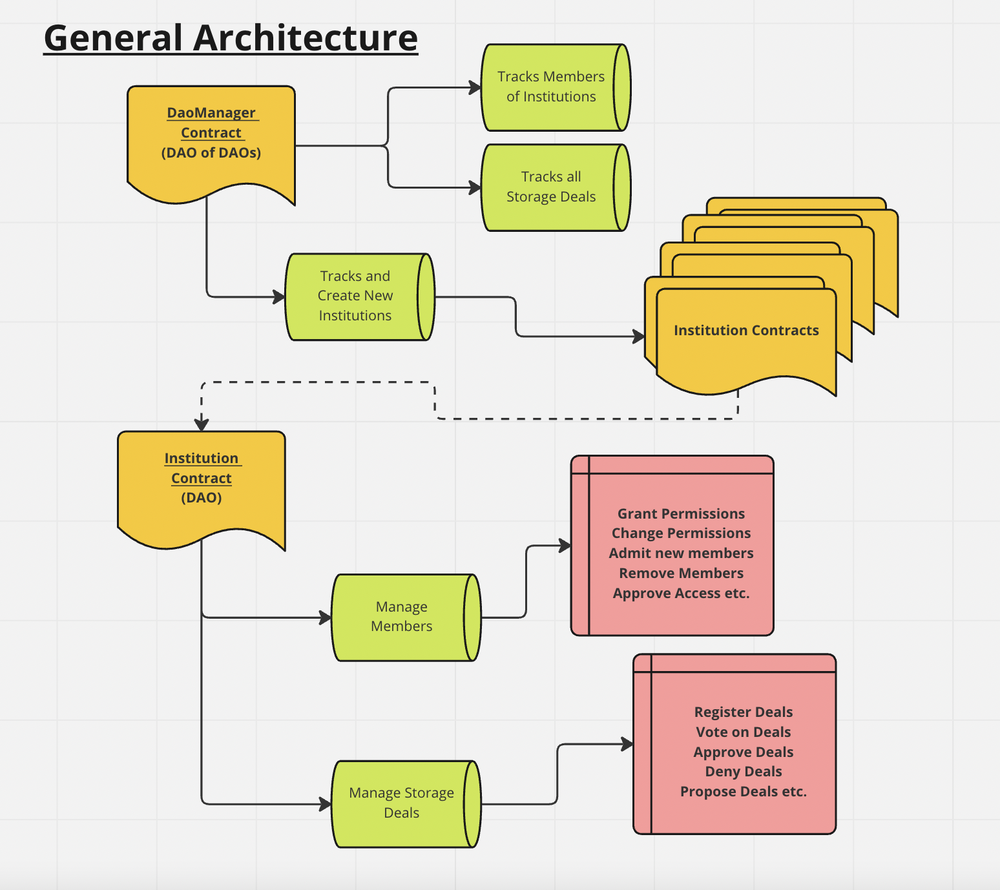

# Labio DataDao

This Repository contains the latest smart contracts for Labio. For links to the application and repo, check below.
<br />

## Description

Labio offers researchers of institutions an alternative data storage, access and maintenance. With Labio DataDao, important data can be storage perpetually by enabling storage to an open-sourced marketplace letting funders and storage providers decide what information is important to keep for the long run. Data is such that it is encrypted only for peer reviewers to see yet they can be stored by anyone preserving the data.

This is enabled by a storage marketplace where members belonging to institutions offer storage data for storage to Storage Providers.

This process first involves members to propose data for storage to their respective institution. Admins of those institutions can vote to accept a data proposal. Once a vote threshold is achieved by admins of their respective institutions, the data is posted on the root DaoManager Contract. Storage Providers can browse through approved data and become a provider storage provider for that data.

Once data is storaged on filecoin, storage providers may come back and validate by claiming a bounty on Labio DAO. The DAO keeps track of the storage providers deal term of the data and which institution such data came from. During reward claims, these providers may claim the reward for their bounty only for the time data has been stored by them. Funds are awarded to the storage provider from each institution to storage providers through Labio DAO. Anyone can fund each institution to keep important information forever.

<br />

## Direct Links

#### Application link: [https://labio.vercel.app/](https://labio.vercel.app/)

#### App Repository: [https://github.com/Manubi/labio](https://github.com/Manubi/labio)

<br />

## Architecture

### Smart contract architectural for Labio DAO.



<br />

## Getting Started:

Install and compile contracts with:

```shell
yarn && yarn compile
```

Start a local blockchain node:

```shell
yarn local-chain
```

Open a new terminal and then deploy the contracts with:

```shell
yarn deploy-dao:dev
```
